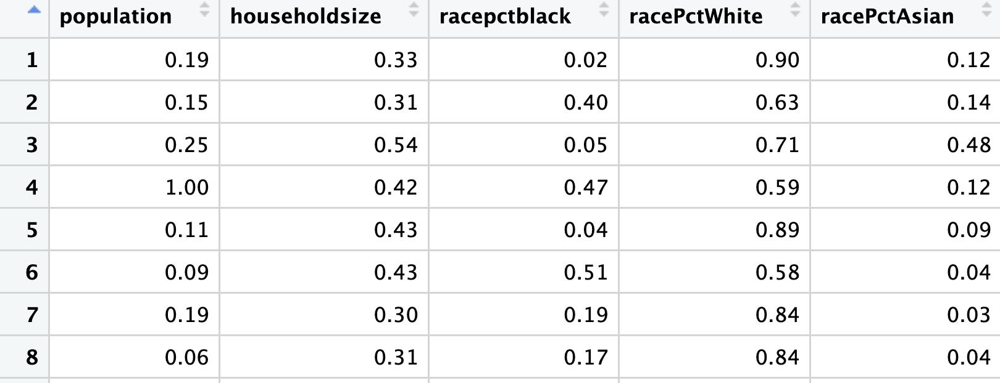

```{r install-package, include = FALSE, eval = FALSE}
install.packages('xaringan')
install.packages("knitr")
```

```{r load-packages, include = FALSE}
library(tidyverse)
library(dplyr)
library(tidyr)
library(readr)
library(corrplot)
library(caret)      
library(randomForest) 
library(plotly)
library(ggplot2)
library(tidymodels) 
library(ranger)    
library(caTools)
library(knitr)
```

```{r setup, include=FALSE}
# For better figure resolution
knitr::opts_chunk$set(fig.retina = 3, dpi = 300, fig.width = 6, fig.asp = 0.618, out.width = "80%")
```

```{r load-data, include=FALSE}
column_names <- c(
    'state', 'county', 'community', 'communityname', 'fold', 'population', 'householdsize',
    'racepctblack', 'racePctWhite', 'racePctAsian', 'racePctHisp', 'agePct12t21',
    'agePct12t29', 'agePct16t24', 'agePct65up', 'numbUrban', 'pctUrban', 'medIncome',
    'pctWWage', 'pctWFarmSelf', 'pctWInvInc', 'pctWSocSec', 'pctWPubAsst', 'pctWRetire',
    'medFamInc', 'perCapInc', 'whitePerCap', 'blackPerCap', 'indianPerCap', 'AsianPerCap',
    'OtherPerCap', 'HispPerCap', 'NumUnderPov', 'PctNotHSGrad', 'PctBSorMore',
    'PctUnemployed', 'PctEmploy', 'PctEmplManu', 'PctEmplProfServ', 'PctOccupManu',
    'PctOccupProfMgmt', 'MalePctDivorce', 'MalePctNevMarr', 'FemalePctDiv', 'TotalPctDiv',
    'PersPerFam', 'PctFam2Par', 'PctKids2Par', 'PctYoungKids2Par', 'PctTeen2Par',
    'PctWorkMomYoungKids', 'PctWorkMom', 'NumIlleg', 'PctIlleg', 'NumImmig',
    'PctImmigRecent', 'PctImmigRec5', 'PctImmigRec8', 'PctImmigRec10', 'PctRecentImmig',
    'PctRecImmig5', 'PctRecImmig8', 'PctRecImmig10', 'PctSpeakEnglOnly',
    'PctNotSpeakEnglWell', 'PctLargHouseFam', 'PctLargHouseOccup', 'PersPerOccupHous',
    'PersPerOwnOccHous', 'PersPerRentOccHous', 'PctPersOwnOccup', 'PctPersDenseHous',
    'PctHousLess3BR', 'MedNumBR', 'HousVacant', 'PctHousOccup', 'PctHousOwnOcc',
    'PctVacantBoarded', 'PctVacMore6Mos', 'MedYrHousBuilt', 'PctHousNoPhone',
    'PctWOFullPlumb', 'OwnOccLowQuart', 'OwnOccMedVal', 'OwnOccHiQuart', 'RentLowQ',
    'RentMedian', 'RentHighQ', 'MedRent', 'MedRentPctHousInc', 'MedOwnCostPctInc',
    'MedOwnCostPctIncNoMtg', 'NumInShelters', 'NumStreet', 'PctForeignBorn',
    'PctBornSameState', 'PctSameHouse85', 'PctSameCity85', 'PctSameState85',
    'LemasSwornFT', 'LemasSwFTPerPop', 'LemasSwFTFieldOps', 'LemasSwFTFieldPerPop',
    'LemasTotalReq', 'LemasTotReqPerPop', 'PolicReqPerPop', 'PolicPerPop',
    'RacialMatchCommPol', 'PctPolicWhite', 'PctPolicBlack', 'PctPolicHisp',
    'PctPolicAsian', 'PctPolicMinor', 'OfficAssgnDrugUnits', 'NumKindsDrugsSeiz',
    'PolicPerPopAgg', 'PolicFieldPerPopAgg', 'LemasPctPolicOnPatr',
    'LemasGangUnitDeploy', 'LemasPctOfficDrugUn', 'PolicBudgPerPop',
    'ViolentCrimesPerPop' # The target variable
)
filename <- 'communities.data'
data_raw <- read_csv(filename, col_names = column_names, na = '?', col_types = cols())
cat(sprintf("Data loaded: %d rows, %d columns\n", nrow(data_raw), ncol(data_raw)))
non_predictive_cols <- c('state', 'county', 'community', 'communityname', 'fold')
data_clean <- data_raw %>% select(-all_of(non_predictive_cols))
data_clean <- data_clean %>% filter(!is.na(ViolentCrimesPerPop))
missing_pct <- sapply(data_clean, function(x) mean(is.na(x)))
cols_to_drop <- names(missing_pct)[missing_pct > 0.5 & names(missing_pct) != "ViolentCrimesPerPop"]
data_clean <- data_clean %>% select(-all_of(cols_to_drop))
data_url <- "https://archive.ics.uci.edu/ml/machine-learning-databases/communities/communities.data"
options(repos = c(CRAN = "https://cloud.r-project.org"))
names_url <- "https://archive.ics.uci.edu/ml/machine-learning-databases/communities/communities.names"
name_lines <- readLines(names_url)
name_lines <- name_lines[grepl("^@attribute", name_lines)]
col_names <- gsub("^@attribute\\s+", "", name_lines)
col_names <- sub("\\s+.*$", "", col_names)
col_names <- col_names[col_names != ""]
crime <- read.csv(data_url, header = FALSE, na.strings = "?", col.names = col_names)
crime <- crime %>%
  select(-state, -county, -community, -communityname, -fold)

data_2 <- crime %>%
  mutate(across(where(is.numeric),
                ~ ifelse(is.na(.), mean(., na.rm = TRUE), .)))
```


# Contents
·Introduction

·Dataset Selection & Understanding

·Data Set & Processing 

·Exploratory Data Analysis

·Model Selection & Evaluation

·Conclusion & Ethics
---
class: inverse, middle, center
# Dataset Selection & Understanding

---

# The data 

.pull-left[
·Communities and Crime dataset

·Socio-economic data from 1990s US

·2000 communities

·122 variables

·5 non-predictive, categorical variables

·Remaining variables all numeric, normalized to the interval [0,1]

·This introduces some complications 
]

.pull-right[

```{r warning=FALSE, out.width="100%", fig.width=4, echo=FALSE}
ggplot(data = data_2, mapping = aes(x = ViolentCrimesPerPop)) +
  geom_histogram(bins = 50, fill = "navyblue", color = "white") +
  labs(title = "Distribution of Violent Crimes per Population", x = "Violent Crime Rate", y = "Count")
```

]


---

# Project Focus

·Find most closely correlated community characteristics to violent crime rates

·Try to model the violent crime rate from the given data

·Find the machine learning model that produces the best predictions


---
class: inverse, middle, center
# Data Set & Processing


---

#Data Set & Processing

Processing Steps:

·Load variable names

·Load observations

·Combine observations and variable names

·Remove non-predictive variables

·Handle missing values

·Clean data
```{r echo= FALSE}

```


---
class: inverse, middle, center

# Exploratory Data Analysis

---

# Summary Statistics
```{r echo = FALSE}
data_clean %>%
  select(ViolentCrimesPerPop, medIncome, PctUnemployed) %>%
  summarise_all(list(
    mean = ~mean(. , na.rm = TRUE),
    sd = ~sd(. , na.rm = TRUE),
    min = ~min(. , na.rm = TRUE),
    max = ~max(. , na.rm = TRUE)
  ))
```

---

# Identifying the Highest Correlated Predictors

```{r echo = FALSE}
correlations <- data_2 %>%
  select(-ViolentCrimesPerPop) %>%
  summarise(across(everything(), ~ cor(., data_2$ViolentCrimesPerPop, use = "complete.obs"))) %>%
  pivot_longer(cols = everything(), names_to = "Variable", values_to = "Correlation") %>%
  arrange(desc(abs(Correlation)))
correlations %>%
  top_n(15, abs(Correlation)) %>%
  ggplot(aes(x = reorder(Variable, Correlation), y = Correlation, fill = Correlation > 0)) +
  geom_col(show.legend = FALSE) +
  coord_flip() +
  labs(title = "Top 15 Features Most Correlated with Violent Crime",
       x = "Variable", y = "Correlation")
```


---
class: inverse, middle, center

# Model Selection & Evaluation

---
# Linear Regression Model

.pull-left[
-   Advantages:

1.  Easy to interpret coefficients

2.  Provides baseline performance

3.  Highlights linear correlations


- Important Results:

1. R² (Coefficient of Determination): ≈ 0.68

2. RMSE (Root Mean Squared Error): ≈ 0.10

]


.pull-right[

-   Disadvantages:

1.  Cannot model nonlinear relationships

2.  Sensitive to outliers

3.  Assumes independence between predictors

]

---

# Random Forest Model

-Compared with the linear Model:

1. confirmed non-linear relationships

2. simple models could not capture the complexity of social data

3. more stable and accurate


-The results:

1.R² (Coefficient of Determination): ≈ 0.83

2. RMSE (Root Mean Squared Error): ≈ 0.06

---

# Comparison (Predicted vs. Actual Plot)


.pull-left[

```{r echo = FALSE}
set.seed(42) 
split <- sample.split(data_clean$ViolentCrimesPerPop, SplitRatio = 0.8)
train_data <- subset(data_clean, split == TRUE)
test_data <- subset(data_clean, split == FALSE)
data_recipe <- recipe(ViolentCrimesPerPop ~ ., data = train_data) %>%
  step_impute_median(all_numeric_predictors()) %>% 
  step_scale(all_numeric_predictors())
lr_spec <- linear_reg() %>%
  set_engine("lm")
rf_spec <- rand_forest(trees = 100) %>%
  set_engine("ranger", importance = "permutation") %>%
  set_mode("regression")
lr_workflow <- workflow() %>%
  add_recipe(data_recipe) %>%
  add_model(lr_spec)
lr_fit <- fit(lr_workflow, data = train_data)
rf_workflow <- workflow() %>%
  add_recipe(data_recipe) %>%
  add_model(rf_spec)
rf_fit <- fit(rf_workflow, data = train_data)
model_metrics <- metric_set(rsq, rmse)
lr_preds <- predict(lr_fit, new_data = test_data) %>%
  bind_cols(test_data %>% select(ViolentCrimesPerPop))
lr_results <- lr_preds %>%
  model_metrics(truth = ViolentCrimesPerPop, estimate = .pred)
rf_preds <- predict(rf_fit, new_data = test_data) %>%
  bind_cols(test_data %>% select(ViolentCrimesPerPop))
rf_results <- rf_preds %>%
  model_metrics(truth = ViolentCrimesPerPop, estimate = .pred)
plot1_lr <- ggplot(lr_preds, aes(x = ViolentCrimesPerPop, y = .pred)) +
  geom_point(alpha = 1.0, size = 2.0, color = "blue") +
  geom_abline(slope = 1, intercept = 0, color = "red", linetype = "dashed", linewidth = 1) +
  labs(
    title = "Linear Regression: Predicted vs. Actual Values",
    x = "Actual Crime Rate",
    y = "Predicted Crime Rate") 
plot1_lr
```

R² = 0.68

RMSE = 0.10

Fair results. Suffered from multicollinearity.

]


.pull-right[

```{r echo = FALSE}

plot1_rf <- ggplot(rf_preds, aes(x = ViolentCrimesPerPop, y = .pred)) +
  geom_point(alpha = 1.0, size = 2.0, color = "darkgreen") +
  geom_abline(slope = 1, intercept = 0, color = "red", linetype = "dashed", linewidth = 1) +
  labs(
    title = "Random Forest: Predicted vs. Actual Values",
    x = "Actual Crime Rate",
    y = "Predicted Crime Rate")
plot1_rf
```

R² = 0.83

RMSE = 0.06

Strong performance, gave good indication on importance.

]


---

# Comparison(Residual Distribution Map)

.pull-left[

```{r echo = FALSE}
lr_preds <- lr_preds %>% mutate(residuals = ViolentCrimesPerPop - .pred)
rf_preds <- rf_preds %>% mutate(residuals = ViolentCrimesPerPop - .pred)
plot2_lr <- ggplot(lr_preds, aes(x = residuals)) +
  geom_histogram(bins = 30, fill = "steelblue", color = "black", alpha = 0.7) +
  geom_vline(xintercept = 0, color = "red", linetype = "dashed", linewidth = 1) +
  labs(
    title = "Linear Regression: Residual Distribution",
    x = "Residual (Error)",
    y = "Frequency") 
plot2_lr

```

linear regression

]

.pull-right[

```{r echo=FALSE}
plot2_rf <- ggplot(rf_preds, aes(x = residuals)) +
  geom_histogram(bins = 30, fill = "darkgreen", color = "black", alpha = 0.7) +
  geom_vline(xintercept = 0, color = "red", linetype = "dashed", linewidth = 1) +
  labs(
    title = "Random Forest: Residual Distribution (Sharply Centered at Zero)",
    x = "Residual (Error)",
    y = "Frequency")
plot2_rf
```

random forest

]
---
class: inverse, middle, center

# Conclusion & Ethics 

---

# Reference

Redmond, M. (2002). Communities and Crime [Dataset]. UCI Machine Learning Repository.

https://doi.org/10.24432/C53W3X.

---
class: inverse, middle, center
# Q & A
---
class: inverse, middle, center

# Thank you 


